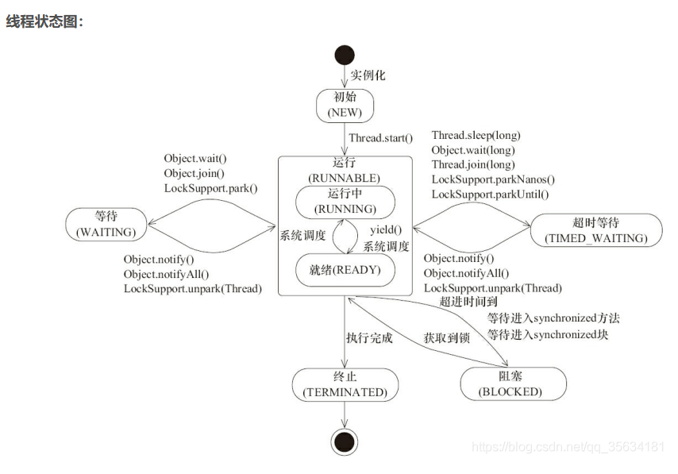

#线程中断的作用：
线程中断可以使一个线程**从等待状态变成就绪状态**，
如果中断的线程正处于运行状态，那么这个中断是不会用任何作用的（表面上不会影响正在运行的线程），
线程恢复到就绪状态后，可以继续执行逻辑代码，
想要让一个线程从等待状态中恢复过来有三种发送：一.等待超时，二.得到一个通知，三.使用中断
使用线程中断，并不是要把线程给终止或是杀死，而是让线程不再继续等待，而是让线程不再继续等待，线程可以继续往下执行代码，
线程发生中断后，会抛出一个中断的异常，决定如何处理就看业务代码怎么写了。

#线程中断的原理：
Thread.interrupt()方法仅仅是在当前线程中打了一个停止的标识**将中断标志修改为true**，并没有真正的停止线程。
如果在此基础上进入堵塞状态（sleep(),wait(),join()）,马上就会抛出一个InterruptedException，且中断标志被清除，重新设置为false。
中断是通过调用Thread.interrupt()方法来做的. 这个方法通过修改了被调用线程的中断状态来告知那个线程, 说它被中断了. 
对于非阻塞中的线程, 只是改变了中断状态, 即Thread.isInterrupted()将返回true; 
对于可取消的阻塞状态中的线程, 比如等待在这些函数上的线程, Thread.sleep(), Object.wait(), Thread.join(), 这个线程收到中断信号后, 会抛出InterruptedException, 同时会把中断状态置回为false.但调用Thread.interrupted()会对中断状态进行复位。

#响应中断的方法:
线程进入等待或是超时等待的状态后，调用interrupt方法都是会响应中断的，所以响应中断的方法：
Object.wait()、Thread.join、Thread.sleep、LockSupport.park的有参和无参方法。

#不响应中断的方法:
线程进入阻塞状态后，是不响应中断的，等待进入synchronized的方法或是代码块，都是会被阻塞的，此时不会响应中断，
另外还有一个不响应中断的，那就是阻塞在ReentrantLock.lock方法里面的线程，也是不响应中断的，
如果想要响应中断，可以使用ReentrantLock.lockInterruptibly方法。

#其ReentrantLock底层是使用LockSupport.park方法进行等待的，前面说了LockSupport.park是响应中断的，
#当线程进入ReentrantLock.lock方法里面进行阻塞后，此时调用Thread.interrupt()方法之后，该线程是会被中断被唤醒的，
#但是唤醒之后，会调用LockSupport.park再次进入等待状态，
#所以仅从宏观（表面）上面看ReentrantLock.lock是不支持响应中断的，从微观（原理）上面讲ReentrantLock.lock内部确实中断了响应，但是还是会被迫进行等待状态

